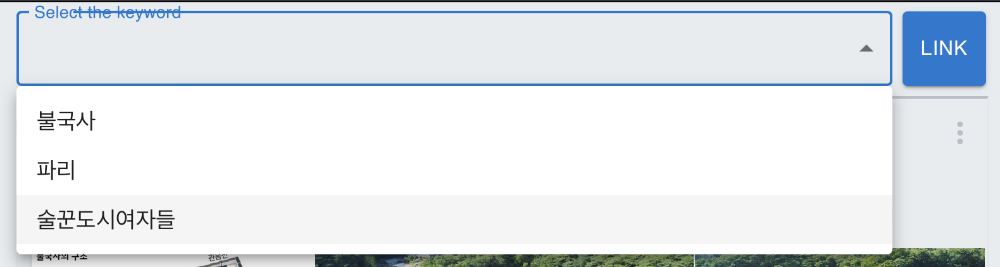
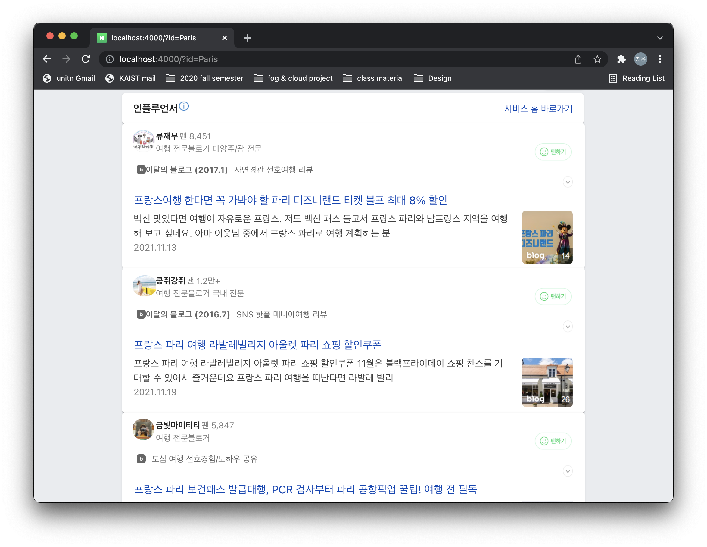
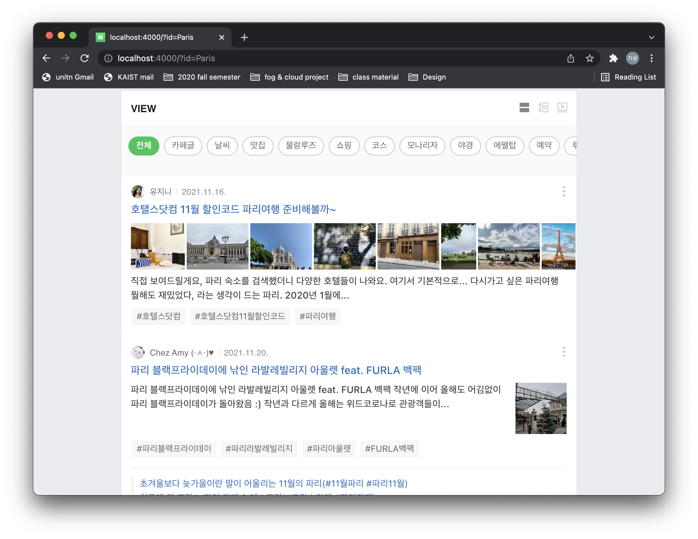
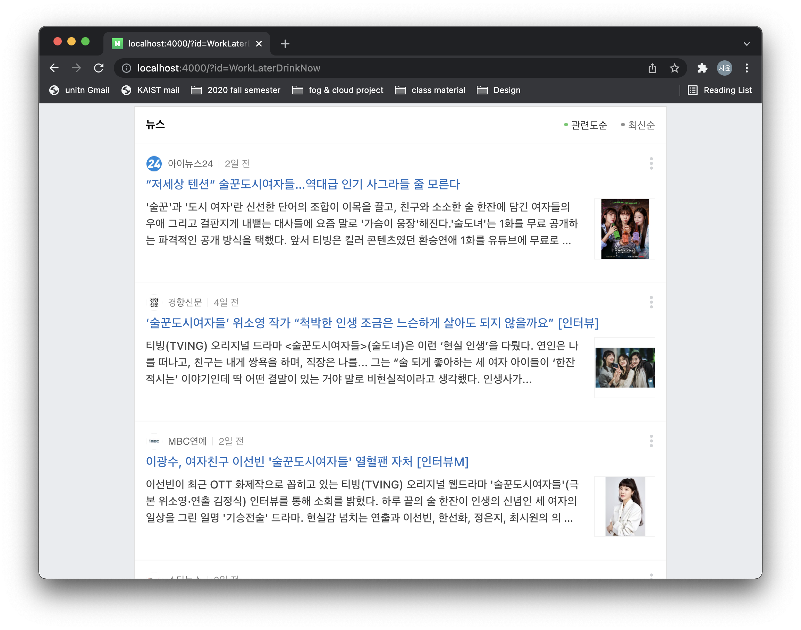
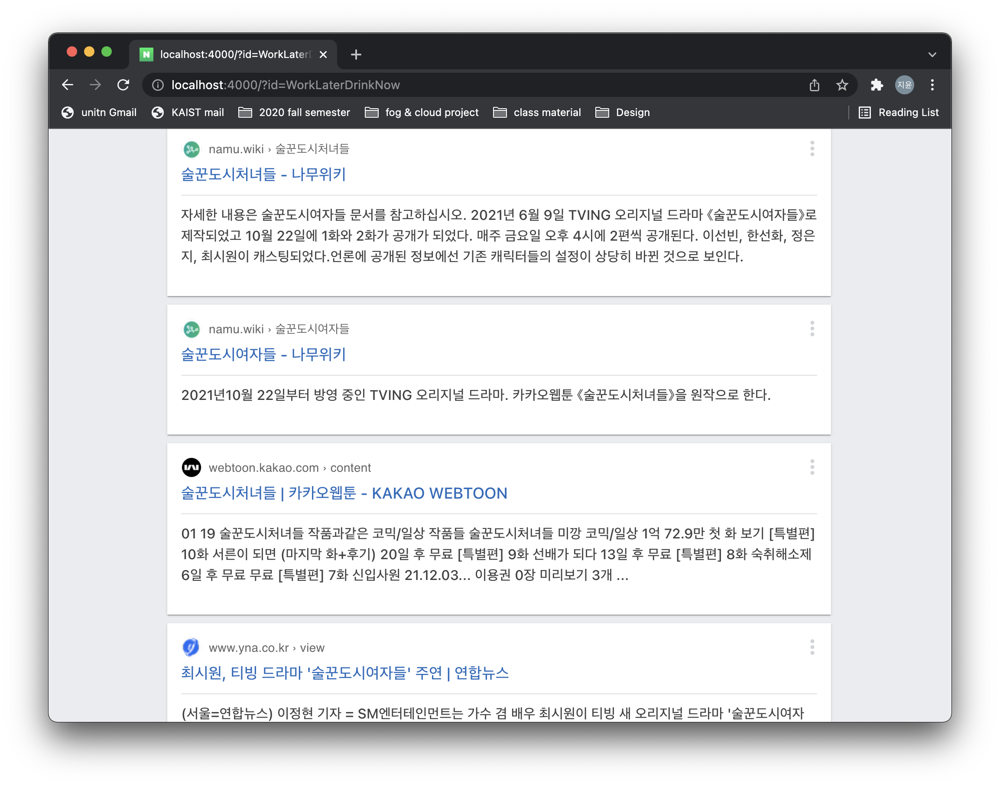
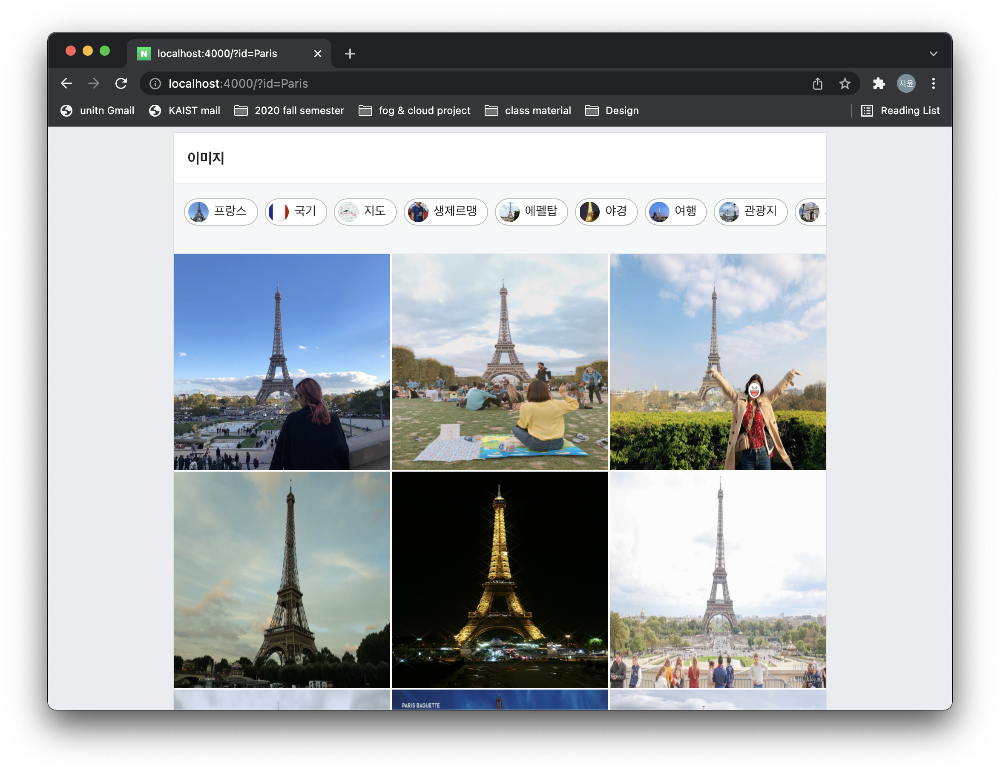
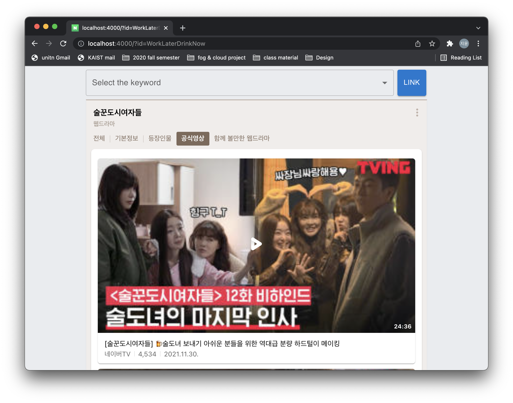
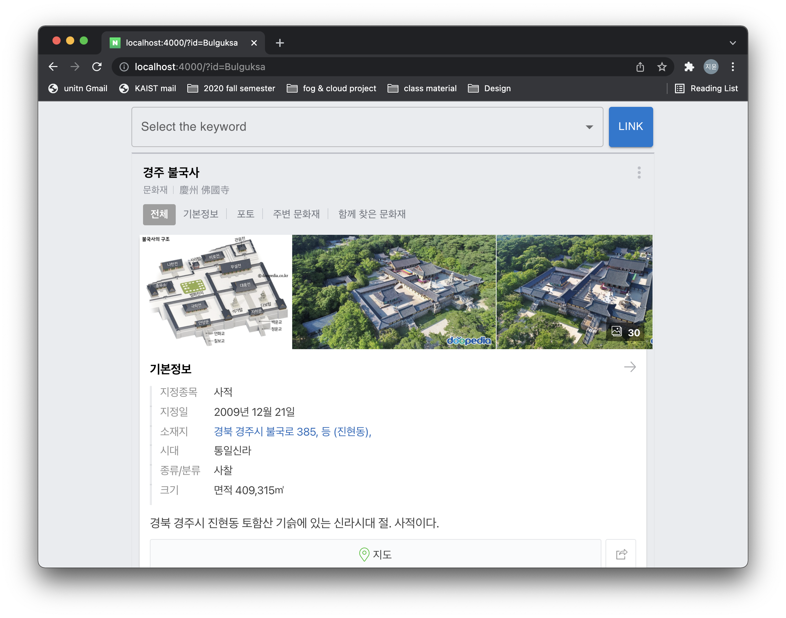
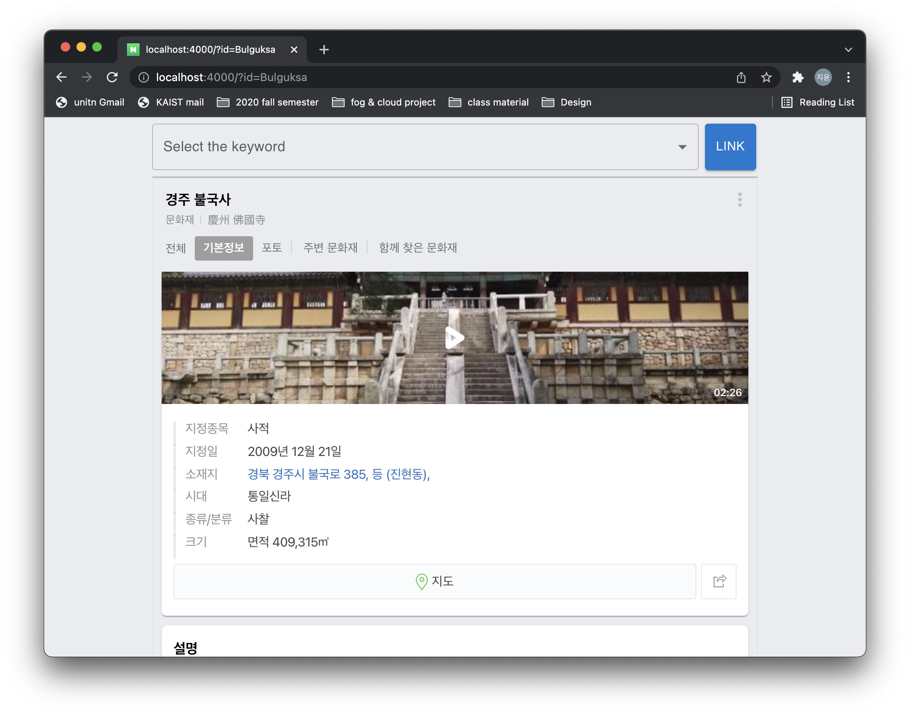

# CS492_Team4_Web_SSR_with_Server_Driven_UI

## Brief overview

Render server와 web server를 개발하여 Naver 모바일(https://m.naver.com) 검색 화면 결과 중에서 N개의 화면을 구현하는 프로젝트 

## Basic info

- **Team members' name**: 김민형, 김수아, 박지윤, 최지호
- **Team members' email**: isa000@kaist.ac.kr, ksa37@kaist.ac.kr, wldbs0507@kaist.ac.kr, legitimation@kaist.ac.kr


## How to run project
### Install
```
$ git clone https://github.com/di-uni/CS492_Team4_Web_SSR_with_Server_Driven_UI.git
$ cd CS492_Team4_Web_SSR_with_Server_Driven_UI
```
Clone the project and install all packages required for this project   

### Run web server
```
$ cd web_server
$ npm install 
$ npm run web
```
### Run db server
```
$ cd ..
$ cd db_server
$ npm install 
$ npm run json
```
### Run render server (Dev)
```
$ cd ..
$ cd render_server
$ npm install 
$ npm run dev
```
Runs the project in the development mode.   
Open https://localhost:4000 to view it in the browser.

### Run render server (Build)
```
(in render_server directory)
$ npm run build
$ npm run start
```
Runs the project after build.   
Open https://localhost:4000 to view it in the browser.


## Detailed description
### How to Use 
1. keyword 선택      
본 프로젝트에서 구현된 키워드는 `불국사`, `파리`, `술꾼도시여자들` 총 3가지이다.  
키워드를 선택해서 해당 키워드와 관련된 페이지를 보기 위해선 두 가지 방법이 있는데, 하나는 페이지 상단의 select box를 이용하는 것이다. 

Select box에서 원하는 키워드를 클릭한 후 'LINK' 버튼을 누르면 된다.

    다른 방법은 url 뒤에 id를 key로 하는 query string을 추가하는 것이다.   
    (불국사)  ```http://localhost:4000/?id=Bulguksa```     
    (파리)   ```http://localhost:4000/?id=Paris```    
    (술꾼도시여자들) ```http://localhost:4000/?id=WorkLaterDrinkNow```  

2. view 선택   
    view 옵션은 url 뒤에 views를 key로 하는 query string을 추가함으로써 선택할 수 있다.   
    ```http://localhost:4000/?id=Paris&views[]=influencer&views[]=review ```   
    위 경우 파리 키워드에 관한 인플루언서 페이지와 VIEW 페이지를 (query string 순서에 맞게) 순서대로 확인할 수 있다.

    구현된 page들의 종류는 아래와 같다. (각 page에 대한 자세한 사항은 WIKI 참고)
    - 인플루언서 / query string value: *influencer*
    
    - VIEW / query string value: *review*   
    
    - 뉴스 / *news*   
    
    - wiki / *wiki*
    
    - 이미지 / *photo*
    
    - 키워드에 따라 달라지는 고유 페이지 / *basic*
    
    
    


## Structure
본 프로젝트는 db server, web server, render server를 이용하여 사용자가 선택한 키워드의 페이지를 보여준다.
- db server : JSON 기반의 mock data를 저장하고 있는 서버
    - http://localhost:5000
- web server : 사용자 요청처리, render server와 db server와의 통신 역할
    - http://localhost:3000
    - express 사용
- render server : 화면 생성/UI 기능을 제공하고 있는 서버
    - http://localhost:4000
    - Next js, javascript 사용   


<!-- ## Resources

1. [Demo Video](https://) Add youtube link later -->

## Credits
- Next js docs: https://nextjs.org/docs/getting-started
- Material UI: https://mui.com/getting-started/usage/
- 네이버 공유하기 api: https://developers.naver.com/docs/share/navershare/
- Jest for unit test: https://jestjs.io/docs/getting-started

## License

 MIT License   

Copyright (c) 2021 Jiyun Park
     
Permission is hereby granted, free of charge, to any person obtaining a copy
of this software and associated documentation files (the "Software"), to deal
in the Software without restriction, including without limitation the rights
to use, copy, modify, merge, publish, distribute, sublicense, and/or sell
copies of the Software, and to permit persons to whom the Software is
furnished to do so, subject to the following conditions:
     
The above copyright notice and this permission notice shall be included in all
copies or substantial portions of the Software.
     
THE SOFTWARE IS PROVIDED "AS IS", WITHOUT WARRANTY OF ANY KIND, EXPRESS OR
IMPLIED, INCLUDING BUT NOT LIMITED TO THE WARRANTIES OF MERCHANTABILITY,
FITNESS FOR A PARTICULAR PURPOSE AND NONINFRINGEMENT. IN NO EVENT SHALL THE
AUTHORS OR COPYRIGHT HOLDERS BE LIABLE FOR ANY CLAIM, DAMAGES OR OTHER
LIABILITY, WHETHER IN AN ACTION OF CONTRACT, TORT OR OTHERWISE, ARISING FROM,
OUT OF OR IN CONNECTION WITH THE SOFTWARE OR THE USE OR OTHER DEALINGS IN THE
SOFTWARE.